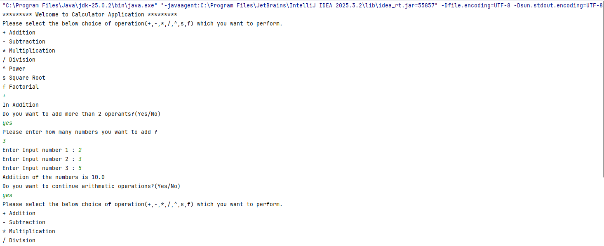
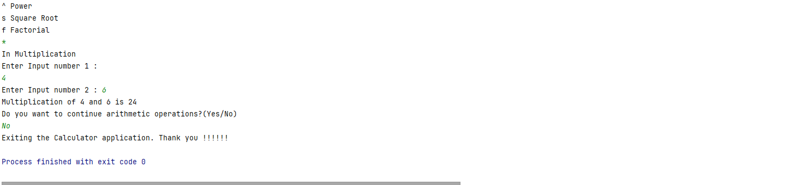
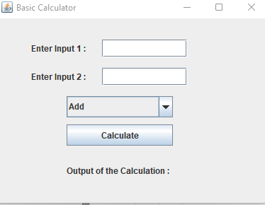

# ****** Calculator Application ******

This is a calculator application which is used to perform basic arithmetic operations like addition, subtraction, multiplication and division. 

This is build on using Java as the primary language and designed both console based application and swing application.

## ****** Console Application ******

Below is how the application displayes the output in console.

## ****** Swing Application ******

Desgined a Swing based application for the calculator app using Jlabel, JFrame, JTextField, JButton, ActionLister etc. 

Desinged the application with more arithmetic operations like add, subtract, multiply, divide, power of the number etc.

